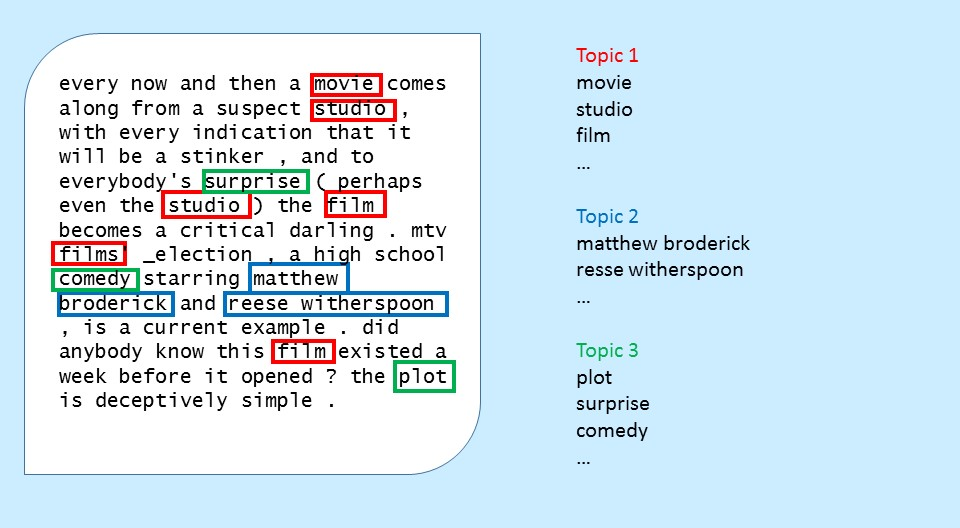

# An Introduction to Topic Modeling
Janae Nicholson, Ph.D.  
January 14, 2017  


## Overview

- Introduction
- High Level Explanation of One Model 
- Topic Models in R
- Visualization


## What is a Topic Model?
 
A Statistical Technique for discovering hidden "topics" from a group of documents.  It is an unsupervised learning technique in that a dependent variable is not supplied.  Rather the text (independent variables) are used to find an underlying structure.
 
Topic models can be used to:
 
- Reduce the dimensionality of a textual data set.
- Summarize large archives of documents.
- Search for documents about a subject.

## A Motivating Example: Movie Reviews


```
##  [1] "every now and then a movie comes along from a suspect studio , with every indication that"
##  [2] "it will be a stinker , and to everybody's surprise ( perhaps even the studio ) the film"  
##  [3] "becomes a critical darling .  mtv films' _election , a high school comedy starring"       
##  [4] "matthew broderick and reese witherspoon , is a current example .  did anybody know this"  
##  [5] "film existed a week before it opened ?  the plot is deceptively simple .  george"         
##  [6] "washington carver high school is having student elections .  tracy flick ( reese"         
##  [7] "witherspoon ) is an over-achiever with her hand raised at nearly every question , way ,"  
##  [8] "way , high .  mr . \" m \" ( matthew broderick ) , sick of the megalomaniac student ,"    
##  [9] "encourages paul , a popular-but-slow jock to run .  and paul's nihilistic sister jumps in"
## [10] "the race as well , for personal reasons .  the dark side of such sleeper success is that" 
## [11] ", because expectations were so low going in , the fact that this was quality stuff made"  
## [12] "the reviews even more enthusiastic than they have any right to be .  you can't help going"
## [13] "in with the baggage of glowing reviews , which is in contrast to the negative baggage"    
## [14] "that the reviewers were likely to have .  _election , a good film , does not live up to"
```

---
 
 
 
##   
<h2>That looks nice but I don't want to read all 2,000 reviews and parse into topics!</h2>

##Latent Dirichlet Allocation (LDA)

LDA is a generative probabilistic model that describes how the data was generated under some basic assumptions.

It uses a Bayesian Hierarchal Model with many parameters.

## Warning!!
The following slides contain Bayesian Statistics!  Bayesians like to make lots of assumptions about the distributions of variables and some parameters! $$\alpha$$

##Things We Know (or Assume we Know)
1. We choose the number of topics, *K*.
2. We have *V* words in the vocabulary.
3. We have *M* documents in the corpus.
4. There are $N_d$ number of words in document *d*.
5. There are *N* total words in the corpus.
6. The observed words for document *d*, $w_d$, is a vector containing the words in the document represented as integers.
7. We assume vectors of hyper-parameters $\alpha$ and $\beta$.  In practice it is common to assume that all the elements of $\alpha$ are the same.  Similarly assume all the elements of $\beta$ are the same.
 
##Things We Do Not Know
1. For each document, $d = 1,..., M$, we come up with a length-*K* vector of probabilities that each topic is represented in the document, $\theta_d$.
2. For each topic, $k = 1,..., K$, we come up with a length-*V* vector of probabilities that each word is represented in the topic, $\phi_k$.
3. For $d = 1,..., M$ and words $j = 1,..., N_d$ in document $d$, we come up with latent topic variables, $z_{d,j}$, that relate each word to a topic.  The $z_{d,j}$ are integers between 1 and *K*.
 
##Assumptions of Distributions
 
$$\theta_d \sim Dirichlet(\alpha)$$
$$\phi_k \sim Dirchlet(\beta)$$
$$z_{d,j}|\theta_d \sim Multinomial(\theta_d)$$
$$w_{d,j}|z_{d,j},\phi_k \sim Multinomial(\phi_k)$$
 
 
##How Many Unknowns to Estimate?
##How Many unknowns to Estimate?
 
> $\theta$ has $M \times K$ unknowns.
  
>> $\phi$ has $K \times V$ unknowns. 
  
>>> $z_{d,j}$ has $N$ unknowns.
 
##How Many unknowns to Estimate?
For our chosen example:
 
- $M = 2000$
- $V = 1608$,
- $N = 495035$
- Choose $K = 20$.
 
$$M \times K + K \times V + N$$
$$= 2000 \times 20 + 20 \times 1608 + 495035 = 567195$$ 

##How Many Unkowns to Estimate?
For our chosen example: 

$$unkown = 567,195 > 495,035 = known$$

##How to Estimate the Unknown Parameters?
1. Expectation Maximization (EM) Algorithm
2. Gibbs Sampler

#Now let's Do this in R!!!
##First Load some necessary packages...

```r
library(shiny)
library(tm); library(SnowballC)
library(topicmodels)
library(LDAvis)
#devtools::install_github("cpsievert/LDAvisData")
library(LDAvisData)
library(dplyr)
library(ggplot2)
```


##Specify How to Create Document Term Matrix

```r
dtm.control <- list(
  tolower = TRUE,
  removePunctuation = TRUE,
  removeNumbers = TRUE,
  stopwords = c(stopwords("english"), "will", "can", "also", "one", "two", "get", "use", "thing"),
  stemming = TRUE,
  wordLengths = c(3, Inf),
  weighting = weightTf,
  stripWhitespace = TRUE
)
```

##Create Document Term Matrix

```r
corpus <- VCorpus(VectorSource(reviews))
dtm <- DocumentTermMatrix(corpus, control=dtm.control)
dtms <- removeSparseTerms(dtm,0.97)
#remove documents that are now empty
rowTotals <- apply(dtms, 1, sum)
dtms <- dtms[rowTotals > 0, ]
dtms
```

```
## <<DocumentTermMatrix (documents: 2000, terms: 1605)>>
## Non-/sparse entries: 336229/2873771
## Sparsity           : 90%
## Maximal term length: 14
## Weighting          : term frequency (tf)
```


##Look at the Top 20 Words
<!-- -->

##Set Up the Parameters

```r
my.k <- 20
alpha <- 0.02
#model parameters for Gibbs Sampling
burnin <- 5000
iter <- 1000
keep <- 100
set.seed(3456)
```

#Run the Model -- This takes a while 

```r
system.time(
  model_lda2 <- LDA(dtms, my.k, method = "Gibbs", control = list(alpha = alpha, burnin = burnin, iter = iter, keep = keep))
)
saveRDS(model_lda2, file = "data/Review_LDA_20_1_14_17.rds")
```

##See if the Gibbs Sampler Stabilized
<!-- -->

##Look at the Results

```
##      Topic 1  Topic 2  Topic 3    Topic 4  Topic 5  Topic 6 Topic 7   Topic 8 Topic 9  Topic 10 
## [1,] "school" "world"  "action"   "film"   "anim"   "film"  "movi"    "film"  "love"   "film"   
## [2,] "sex"    "film"   "murder"   "scene"  "disney" "stori" "star"    "music" "comedi" "charact"
## [3,] "high"   "john"   "cop"      "bad"    "voic"   "citi"  "effect"  "song"  "romant" "like"   
## [4,] "girl"   "scienc" "thriller" "plot"   "stori"  "book"  "seri"    "girl"  "friend" "movi"   
## [5,] "teen"   "comput" "movi"     "action" "kid"    "angel" "special" "rock"  "marri"  "make"   
##      Topic 11 Topic 12 Topic 13 Topic 14  Topic 15 Topic 16 Topic 17 Topic 18 Topic 19 Topic 20
## [1,] "alien"  "horror" "joe"    "film"    "famili" "action" "comedi" "war"    "play"   "movi"  
## [2,] "ship"   "scream" "new"    "charact" "life"   "jacki"  "funni"  "men"    "movi"   "film"  
## [3,] "film"   "movi"   "tom"    "like"    "mother" "film"   "laugh"  "black"  "film"   "like"  
## [4,] "planet" "killer" "hank"   "just"    "father" "fight"  "joke"   "polit"  "actor"  "just"  
## [5,] "effect" "film"   "york"   "movi"    "year"   "batman" "movi"   "battl"  "role"   "even"
```

##Necessary Function

```r
ldavis_topicmodels_json <- function(fitted.model){
  phi <- posterior(fitted.model)$terms %>% as.matrix
  theta <- posterior(fitted.model)$topics %>% as.matrix
  vocab <- colnames(phi)
  token.id <- fitted.model@wordassignments$i  
  doc_length <- as.numeric(table(token.id))
  word.id <- fitted.model@wordassignments$j
  term.frequency <- as.numeric(table(word.id))
  
  json_lda <- LDAvis::createJSON(phi = phi, theta = theta,
                                 vocab = vocab,
                                 doc.length = doc_length,
                                 term.frequency = term.frequency)
  return(json_lda)
}
```

##Show Topic Model Results

```r
json.obj <- ldavis_topicmodels_json(model_lda2)
#run the shiny app locally
serVis(json.obj)
```


##Comparison with a similar analysis
This data has been analyzed in a [similar way.](http://cpsievert.github.io/LDAvis/reviews/reviews.html)  

With a similar [output](http://cpsievert.github.io/LDAvis/reviews/vis/#topic=7&lambda=0.6&term=)  

But my results are differerent for the following reasons:

- I used a different set of words for stop words (removed words).
- I used a different package to compute the model.
- I used a differnt random seed.

##Choosing the Number of Topics, $K$

- Choose a manageable number that is helpful to you.  
-- (You can always try a few.)
- Maximize the Logliklihood or a function of the Logliklihood with respect to $K$. 
- Use Hierarchal Dirichlet Process.
- Use perplexity (Stanford Topic Modeling Toolbox).


##Other Topic Models  

- Structural Topic Modeling
- Relational Topic Modeling
- Correlated Topic Models
- Hierarchial Dirichlet Process


##Further Information on LDA

Wikipedia Article  
[https://en.wikipedia.org/wiki/Latent_Dirichlet_allocation](https://en.wikipedia.org/wiki/Latent_Dirichlet_allocation)

Nice Review of LDA  
[http://dl.acm.org/citation.cfm?id=2133826](http://dl.acm.org/citation.cfm?id=2133826)

Example using Comics  
[http://cpsievert.github.io/projects/615/xkcd/](http://cpsievert.github.io/projects/615/xkcd/)


##Packages in R

[topicmodels](https://cran.r-project.org/web/packages/topicmodels/index.html)

[lda](https://cran.r-project.org/web/packages/lda/index.html)

[mallet](https://cran.r-project.org/web/packages/mallet/index.html)

[LDAvis](https://cran.r-project.org/web/packages/LDAvis/index.html)
